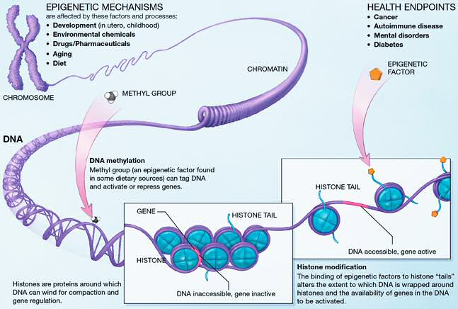
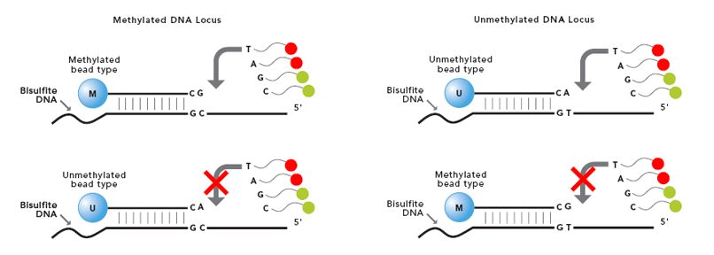
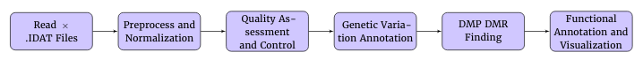
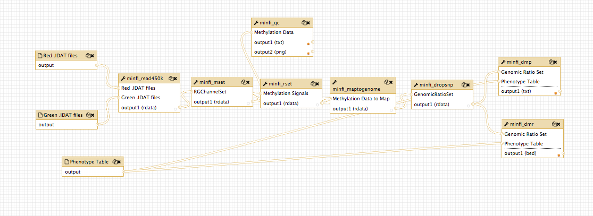
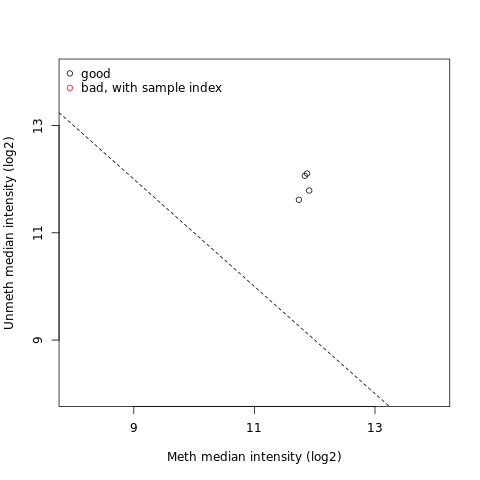
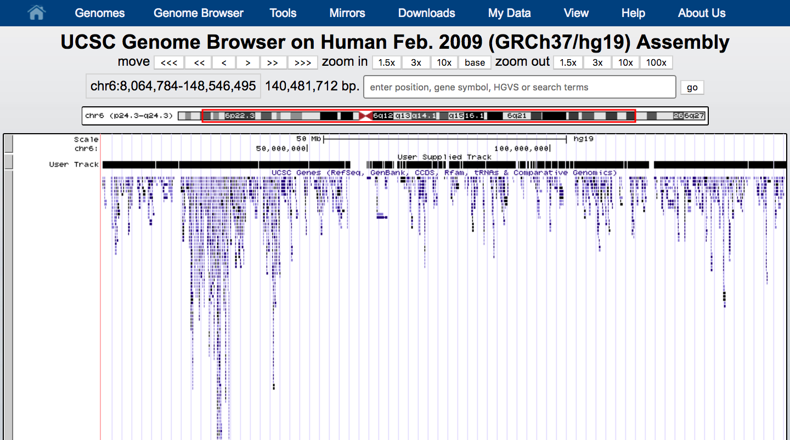
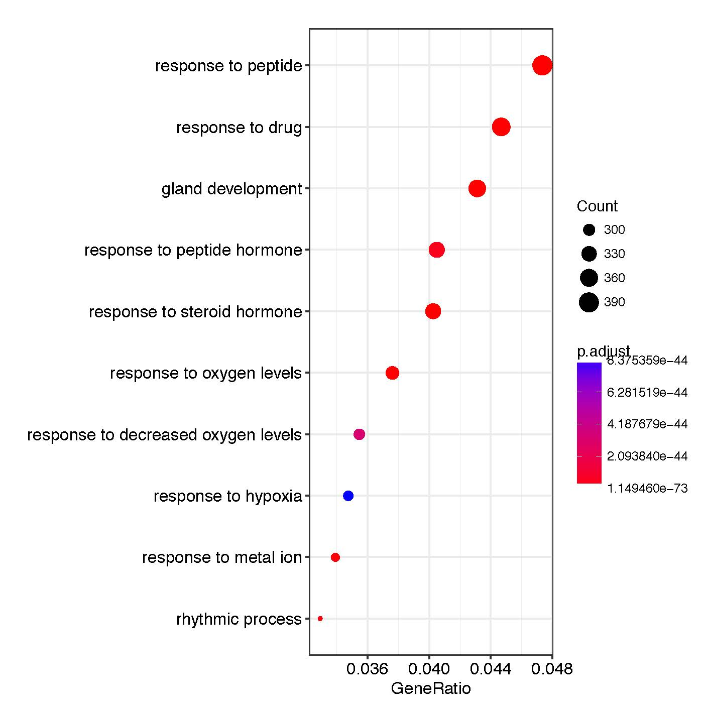

# Introduction
{:.no_toc}

<!-- This is a comment. -->

The field of cancer genomics has demonstrated the power of massively parallel sequencing techniques to give information regarding the genes and specific alterations that drive tumor onset and progression. Although large comprehensive sequence data sets continue to be made increasingly available, data analysis remains an ongoing challenge, particularly for laboratories lacking dedicated resources and bioinformatics expertise. To address this we are providing training based on the Galaxy tools EWAS suite that represents many popular algorithms for detecting somatic genetic alterations from cancer genome and exome data.  

> 

This exercise uses the dataset from the Cell publication by Hugo, Willy, et al., 2015 [(DOI: 10.1016/j.cell.2015.07.061)](https://www.ncbi.nlm.nih.gov/pubmed/26359985). The goal of this article was to identify differentially methylated regions and positions associated with treatment resistant melanomas.

To identify these regions and positions, an Illumina 450K Methylation array was performed on melanoma tumors from example patients pre and post MAPKi and BRAFi treatment with different outcomes (sensitive and resistant). For each sample there are raw green and red color arrays containing the summarized bead information generated bythe Illumina 450k scanner, i.e. there are 8 files in total:

The Infinium Methylation Assay 450k uses two different bead types to detect changes in DNA methylation levels. In the figure we can see M - methylated and U - unmethylated bead types. In our study, unmethylated and methylated bead signals are reported as green and red colors respectively.

> 

Accession  | Sensitivity | Treatment
--- | ---  | ---
GSM1588704 | baseline    | pre-treatment
GSM1588705 | baseline    | pre-treatment 
GSM1588706 | resistant   | BRAFi
GSM1588707 | resistant   | BRAFi

> ### Agenda
> 
> 
> 1. TOC
>{:toc}
> 
{: .agenda}

# 450K Array Data Upload

The first step of EWAS data analysis is raw methylation data loading (intensity information files for each two color micro array)

> ###  Hands-on: Data Loading
>
> 1. Create a new history for this tutorial and give it a proper name
> 2. Import the .IDAT files listed below from [Zenodo](https://zenodo.org/record/1251211#.WwREQ1Mvz-Y)

> Red Files
>
> `GSM1588704_8795207135_R01C02_Red.idat`
 `GSM1588705_8795207119_R05C02_Red.idat`
> `GSM1588706_8795207135_R02C02_Red.idat`
`GSM1588707_8795207119_R06C02_Red.idat`

> Green Files
>
> `GSM1588704_8795207135_R01C02_Grn.idat`
`GSM1588705_8795207119_R05C02_Grn.idat`
> `GSM1588706_8795207135_R02C02_Grn.idat`
`GSM1588707_8795207119_R06C02_Grn.idat`

> 3. Run **minfi read450k**   with red and green .IDAT files 
> 4. Inspect generated set of data
{: .hands_on}

> ###  Questions
>
> How are the Green and Red signals are stored?
>	
> > ###  Solution 
>    > Green and Red micro arrays are builded up into `RGChannelSet` 
> {: .solution}
>
{: .question}  

# Preprocessing and Quality Assessment
Preprocessing and data quality assurance is an important step in Infinium Methylation Assay analysis. 
The `RGChannelSet` represents two color data with a green and red channel that can be converted into methylated and unmethylated signals assigned to `MethylSet` or into Beta values build in `RatioSet` using the **minfi mset** tool

> The **minfi qc**  tool extracts and plots the quality control data frame with the two columns mMed and uMed, which are the median values of `MethylSet` signals (Meth and Unmeth). Comparing them allows for the detection and removal of low-quality samples. 

> ###  Hands-on: Preprocessing
> 1. Run **minfi mset**  to create `MethylSet` object
> 2. Run **minfi qc**  to estimate sample-specific quality control
> 3. Convert methylation data from the `MethylSet`, to ratios with **minfi rset** 
> 4. Then map ratio data to the genome using **minfi maptogenome**  tool  
> > ###  Tip: Preprocess and Normalize data
> >
> > If your files require normalization, you might prefer to use other preprocessing tools provided in EWAS suite i.e. **minfi ppfun**  or **minfi ppquantile**   look for recomendation at (ref).
<!-- What are you planning to link to in (ref)? -->
> >
>    {: .tip}
> 
{: .hands_on}

> 

# Removing probes affected by genetic variation
Incomplete annotation of genetic variations such as single nucleotide polymorphism (SNP) may affect DNA measurements and interfere results from downstream analysis. 

> ###  Hands-on: Removing probes affected by genetic variation
> 1. Run **minfi dropsnp**  to remove the probes that contain either a SNP at the metylated loci interrogation or at the single nucleotide extension (highly recommended by Hansen, J. P. 2014)
<!-- What is the DOI for Hansen, J.P. 2014 so it can be linked? -->
{: .hands_on}

# DMPs and DMRs Identification
The main goal of the EWAS suite is to simplify the detection of differentially methylated loci sites. The EWAS suite contains **minfi dmp**  tool detecting differentially methylated positions (DMPs) with respect to a phenotype covariate, and more complex **minfi dmr**  solution for finding differentially methylated regions (DMRs). Genomic regions that are differentially methylated between two conditions can be tracked using a bumphunting algorithm. The algorithm first implements a t-statistic at each methylated loci location, with optional smoothing, then groups probes into clusters with a maximum location gap and a cutoff size to refer the lowest possible value of genomic profile hunted by our tool.
> ###  Hands-on: DMPs and DMRs Identification
>
> 1. Import `phenotypeTable.txt` from [Zenodo](https://zenodo.org/record/1251211#.WwREQ1Mvz-Y)
> 2. Run **minfi dmp**  with 
>   - `GenomicRatioSet` from step 4 and `phenotypeTable.txt`
>   -  Phenotype Type = `categorical`
>   -  qCutoff Size = `0.5` (DMPs with an FDR q-value greater than this will not be returned)
>   -  Variance Shrinkage =` TRUE` (is recommended when sample sizes are small <10)
> 3. Run **minfi dmr**  
>   - `GenomicRatioSet` from step 4 and phenotypeTable.txt
>   - factor1 = `sensitive` factor2 = `resistant` (factor1 vs factor2)
>   - maxGap Size = `250`
>   - coef Size =`2`
>   - Cutoff Size = `0.1`
>   - nullMethod = `permutation`
>   - verbose = `TRUE`
> 4. Visualize `Differentially Methylated Regions` with `UCSC`
>  - Click on the **minfi dmr**   output in your history to expand it
>  - Click on the pencil button displayed in your dataset in the history set Database/Build `Human Feb. 2009 (GRCh37/hg19) (hg19)`
>  - Press **Save**
>  - Towards the bottom of the history item, find the line starting with `display at UCSC`
>  - This will launch UCSC Genome Browser with your Custom Track
> > ###  Tip: Phenotype table
> >
> > Phenotype table can be in diffrent size with diffrent arguments only second column is required to contain phenotype covariate information for each sample. 
> {: .tip}
>
{: .hands_on}
  
> ###  Questions
> What is a phenotype covariate?
> > ###  Solution
> > Phenotype covariate is the set of observable characteristics of an individual resulting from the gene-environment interactions.</li>
> {: .solution}
{: .question}
> 
# Annotation and Visualization
In addition to downstream analysis users can annotate the differentially methylated loci to the promoter regions of genes with gene function description and relationships between these concepts.

> ###  Hands-on:  Annotate Differentially Methylated Position
> 1. Run **chipeakanno annopeaks**  with
> - `Differentially Methylated Positions` from Step 4
> - bindingType: `StartSite`
> - promoter region defined as upstream bindingRegionStart:`-5000` 
> - downstream 3000 from TSS (transcription start sites) bindingRegionEnd:`3000`
> - Additional Column of Score:`8` optional value if it is required 
> 2. **Cut**   "gene_name" Column from Table of Annotated Peaks to get List of Genes
> - Cut columns: `c16`
> - Delimited by: `Tab`
> 3. **Remove beginning**  of `Gene List`
> - Remove first: `1`
> 4. Convert List of Genes to List of entrez ID using **clusterProfiler bitr** 
> - Input Type Gene ID: `SYMBOL`
> - Output Type Gene ID: `ENTREZID`
> 5. Run GO Enrichment Analysis of a `gene set` with **clusterProfiler go** 
>
> > ###  Tip: Biological id translator
> >  No matter what ID we need, this tool allows various conversions suitable for different databases and annotations.
>    {: .tip}
{: .hands_on}

>    

ID  | Description | pvalue | qvalue | geneID | Count
--- | ---  | --- | --- | --- | --- 
GO:0048732 | gland development  | 1.38E-58 | 4.23E-55 | PTGS2 / KCNC1 / FZD1 /SLC22A18 /SLC22A3 (...) | 372
GO:1901652 | response to peptide | 3.99E-57 | 8.13E-54 | SULF1/ LAMA5/ MED1 /CFLAR/ MSX2 (...) | 359
GO:0048545 | response to steroid hormone | 1.38EE-54 | 2.11E-51 | HDAC9/ RAB10/ CFLAR/ WDTC1 (...) | 394

# Conclusion
{:.no_toc}

Epigenetic aberrations which involve DNA modifications give researchers an interest to identify novel non-genetic factors responsible for complex human phenotypes such as height, weight and disease. To identify methylation changes researchers need to perform complicated and time consuming computational analysis. Here, the EWAS suite becomes a solution for this inconvenience and provides a simplified downstream analysis available as ready to run pipline in supplementary materials. 

